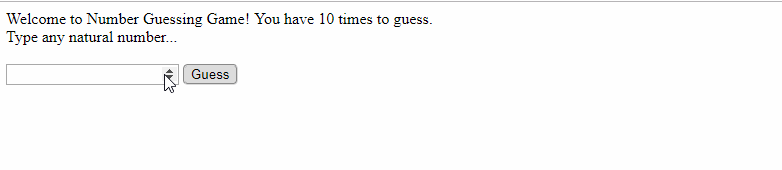

# NumberGuessingGame
This is the assignment for Week 01.

**Time spent:** 2.5 hours spent in total

**Completed user stories:**

* [x] Milestone 1: Setting up your UI elements
* [x] Milestone 2: Bind the event to elements
* [x] Milestone 3: Get Value From User Input
* [x] Milestone 4: Show the correct message
* [x] Milestone 5 (Optional): Show user's past guesses
* [x] Milestone 6 (Optional): Change message container color
* [x] Milestone 7 (Optional): Limit person to 10 guesses, show many guesses remaining

**Walkthrough of all user stories:**

GIF created with [LiceCap](http://www.cockos.com/licecap/).
